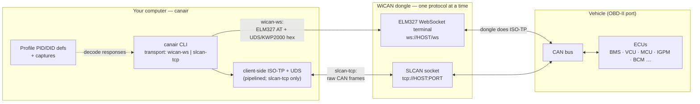
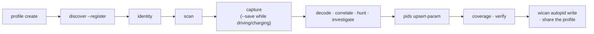

# canair

**CLI for reverse engineering CAN/OBD diagnostics over-the-air using a WiCAN dongle**

[](https://philipkocanda.github.io/canair/)
[](https://github.com/philipkocanda/canair/actions/workflows/ci.yml)
[](LICENSE)


canair interfaces with a [WiCAN](https://www.meatpi.com/products/wican-pro) OBD-II WiFi dongle to work with a vehicle's data across **two domains**: request/response **diagnostics** (querying ECUs over UDS and KWP2000) and the **raw broadcast CAN** the car emits on its own (passively sniffed, or imported from external logs and DBCs). On top of both it gives you a full **analysis suite** — capture, decode, statistically correlate, and hunt down which byte carries which signal — then turns the results into a [WiCAN vehicle profile](https://meatpihq.github.io/wican-fw/config/automate/new_vehicle_profiles) or shareable documentation.

Everything ships as a single installable CLI, **`canair`**. Vehicle data lives in a *profile* bundle; the repo ships profiles under [`profiles/`](profiles/) (the mature `profiles/ioniq-2017/`, a 2017 Hyundai Ioniq Electric, is the reference example). The tooling is vehicle-agnostic — build one for your car (see [Bring your own car](https://philipkocanda.github.io/canair/bring-your-own-car/overview/)).

**Built for both human *and* agentic use.** Every capability is a composable, scriptable subcommand with structured (`--json`) output, so it works equally well driven by a person at a terminal or by an AI coding agent (e.g. Claude). The reverse-engineering workflows are captured as agent skills in `.claude/skills/`.

**Both the WiCAN Pro and the classic (non-Pro) WiCAN are supported** over the default raw-SLCAN transport. A few features are Pro-only (AutoPID device sync, `wican mode set`, the `wican-ws` transport); set `wican_model: classic` and canair cleanly refuses them. See [connecting your dongle](https://philipkocanda.github.io/canair/getting-started/connect-device/).

> **📖 Documentation:** **[philipkocanda.github.io/canair](https://philipkocanda.github.io/canair/)** —
> [Getting started](https://philipkocanda.github.io/canair/getting-started/install/) · [**Bring your own car**](https://philipkocanda.github.io/canair/bring-your-own-car/overview/) (the full new-vehicle walkthrough) · [Concepts](https://philipkocanda.github.io/canair/concepts/architecture/) · [Reference](https://philipkocanda.github.io/canair/reference/config/). (Source in [`docs/`](docs/index.md).)

| | |
|---|---|
|  | Analyzing/decoding a captured signal with `canair decode <query> --plot` |
|  | Byte-level capture diffs with `canair captures <query> --diff` (also the default view for `canair read` on a live vehicle) |

## How it connects

`canair` never talks CAN directly — it reaches the bus through an adapter via one of three explicitly-selected transports: **`slcan-tcp`** (default; raw SLCAN over TCP, any WiCAN, canair does ISO-TP+UDS), **`wican-ws`** (Pro only; ELM327 over WebSocket, the dongle does ISO-TP), or **`elm327-tcp`** (a generic ELM327 clone — Kiwi/vLinker/OBDLink, or the [ELM327-Emulator](https://philipkocanda.github.io/canair/development/offline-testing/) — over a plain TCP socket, no WiCAN needed). The **WiCAN is recommended and best-tested**; generic clones are best-effort and less likely to work on newer vehicles (long multi-frame ISO-TP, extended addressing).



Responses are decoded into named signals using the active profile's definitions. See [Architecture](https://philipkocanda.github.io/canair/concepts/architecture/) for the transports, protocols (UDS / KWP2000 / ISO-TP), and the two data domains.

## Commands

All functionality is exposed as `canair <subcommand>`; run `canair <cmd> --help` for details, or see the [CLI reference](https://philipkocanda.github.io/canair/reference/cli/).

**Live device**

| Subcommand | Purpose |
|--------|---------|
| `canair status` | Snapshot of transport, device mode, reachability, and canair/WiCAN versions (alias: `st`). |
| `canair logs` | View the central diagnostics log (transport drops/errors), size-rotated and self-cleaning. |
| `canair read` | Send UDS/KWP2000 requests — signal reads, multi-ECU pipelines (alias: `query`). Companions: `discover`, `io`, `routines`, `raw`, `repl`. |
| `canair monitor` | Live, continuously-refreshing view of ECU signals (scrollable TUI); records with `--save`, `--wait` to start when the device appears and auto-reconnect on drops (alias: `mon`). |
| `canair scan` | Probe DID/routine/iocontrol/session ranges for responses. |
| `canair dtc` | Read/clear Diagnostic Trouble Codes; report changes since the last scan. |
| `canair identity` | Decode ECU identity DIDs — part number, versions, serial, VIN (alias: `id`). |
| `canair sniff` | Passive CAN-bus sniffer (raw SLCAN) with optional frame logging. |
| `canair lock` | Show or clear the single-session device lock — the escape hatch for a stuck/orphaned session ([safety](https://philipkocanda.github.io/canair/concepts/safety/)). |

**Analysis**

| Subcommand | Purpose |
|--------|---------|
| `canair captures` | Search/diff saved diagnostic captures, or `--step` through them (several PIDs stacked in one time-joined frame) (`captures uds`); infer & back-fill (`--backfill-states`) or manually set (`--set-state`) session states; list raw-CAN frame logs (`captures can`) (alias: `cap`). |
| `canair decode` | Value-centric decoding of captures (mini-language QUERY, multi-PID) — stats, correlation, `--plot`, candidate-expression testing (alias: `dec`). |
| `canair align` | Time-aligned wide table of several cross-ECU signals side by side (CSV/JSON/table). |
| `canair correlate` | Rank the strongest cross-signal relationships across a drive; find mirrored signals (`uds` captures \| `can` frame log). |
| `canair hunt` | "Which byte *is* this known signal?" — sweep, correlate, fit, unit-guess (`uds` PID \| `can` frame ID). |
| `canair investigate` | One-shot per-byte report for an unknown PID, or a ranked summary sweep over an ECU / the whole profile; `--counters` hunts monotonic counters (odometer / hour meter / cycle count). |
| `canair coverage` | Audit PID definitions for decoding gaps (alias: `cov`). |
| `canair research` | Report the open reverse-engineering backlog. |

**Authoring**

| Subcommand | Purpose |
|--------|---------|
| `canair pids` | Add/update `ecus/` signals and research entries (validated). |
| `canair signals` | Add/update broadcast signal definitions (`signals/`, DBC-compatible linear model). |
| `canair ecu` | Inspect ECUs (`ecu <ECU> pids` = per-PID latest state), register one offline (`ecu add`), rename one (`ecu rename`), or open its YAML in `$EDITOR` (`ecu <ECU> edit`, TTY only). |
| `canair bus` | List the profile's CAN bus segments, their descriptions, and ECU counts. |
| `canair states` | List/edit the vehicle operating-state vocabulary and its specificity hierarchy; `states <STATE>` shows which ECUs are readable in it. |
| `canair groups` | List/edit named selector groups (saved queries); recall one as `@name` in `read`/`monitor` (e.g. `monitor @charging`). |
| `canair wican` | Generate the WiCAN AutoPID JSON; upload/download/diff (Pro). |
| `canair validate` | Validate `ecus/`, `profile.yaml`, and `captures/` against their schemas (alias: `val`). |

**Import / export**

| Subcommand | Purpose |
|--------|---------|
| `canair import` | Bring data into the profile: `import uds` (device-free UDS payload), `import can` (raw frame log), `import dbc` (signal defs). |
| `canair export` | Export broadcast signal defs (`signals/`) to DBC for SavvyCAN/cabana/Wireshark. |

**Setup**

| Subcommand | Purpose |
|--------|---------|
| `canair profile` | Manage profile bundles — create/list/show/path (alias: `prof`). |
| `canair contribute` | Open a pull request sharing the active profile upstream (via `gh`; no manual fork). |
| `canair config` | View/manage user config. |
| `canair update` | Update canair from its git clone (checkout release tag + reinstall); links the changelog. |

> The byte-index converter `canair bix` (WiCAN ↔ ISO-TP ↔ Torque ↔ OBDb) and `canair completion` round out the utilities.

> Separate package [`wican-cli`](https://github.com/philipkocanda/wican-cli) handles WiCAN *device* management (config, sleep/power, status, reboots). `pip install wican-cli`.

## Quick start

You need a **WiCAN dongle** (Pro *or* classic), a car with an OBD-II port, and [`uv`](https://docs.astral.sh/uv/).

```bash
git clone https://github.com/philipkocanda/canair.git
cd canair
uv tool install .                       # install the `canair` CLI
canair config set devices.home.host 192.168.1.100
canair config set default_wican home
canair status                           # is the device reachable?
canair discover                         # list every ECU on the bus (any car)
canair read BMS:2101                    # read a PID (Ioniq profile)
canair monitor @charging                # monitor a saved selector group (see `canair groups`)
```

Full setup — installing, connecting the dongle (Pro vs classic, AP vs LAN), tab-completion, and your first read — is in [Getting started](https://philipkocanda.github.io/canair/getting-started/install/).

canair checks once a day for a newer release (offline-safe, never blocking) and points you at the changelog; upgrade in place with `canair update` (checks out the latest release tag + reinstall). See [staying up to date](https://philipkocanda.github.io/canair/getting-started/install/#staying-up-to-date).

> **You don't need to be a CAN expert to start.** Reading is safe and free — canair only *reads* unless you explicitly actuate something, and every state-changing action confirms first. Interacting with a vehicle bus still carries real risk: see the [Warning](#warning).

## Bring your own car

The bundled Ioniq profile is just an *example*. To reverse-engineer *your* car, build your own profile and let the discovery/scan commands populate it as you go:



Each step has a dedicated page under [**Bring your own car**](https://philipkocanda.github.io/canair/bring-your-own-car/overview/): [create](https://philipkocanda.github.io/canair/bring-your-own-car/01-create-profile/) · [discover](https://philipkocanda.github.io/canair/bring-your-own-car/02-discover-ecus/) · [identity](https://philipkocanda.github.io/canair/bring-your-own-car/03-identity/) · [scan](https://philipkocanda.github.io/canair/bring-your-own-car/04-scan/) · [capture](https://philipkocanda.github.io/canair/bring-your-own-car/05-capture/) · [analyze](https://philipkocanda.github.io/canair/bring-your-own-car/06-analyze/) · [define & verify](https://philipkocanda.github.io/canair/bring-your-own-car/07-define-and-verify/) · [share](https://philipkocanda.github.io/canair/bring-your-own-car/08-share/).

## Profiles

A *profile* bundles one vehicle's data — `ecus/` (one file per ECU, the source of truth), `profile.yaml`, `captures/`, `references/`, and generated `out/`. The repo ships one or more profiles under [`profiles/`](profiles/) (the mature `profiles/ioniq-2017/` is the reference example). Manage them with `canair profile list` / `create` / `use`, and select with `--profile` / `CANAIR_PROFILE` / `default_profile`. See [Bundled profiles](https://philipkocanda.github.io/canair/profiles/) for the full list and [Profiles](https://philipkocanda.github.io/canair/concepts/profiles/) for the layout, precedence, and discovery order.

## The bundled Ioniq profile

The `ioniq-2017` profile makes canair a ready-to-use diagnostics toolkit for the **2017 Hyundai Ioniq Electric (28 kWh, `AE` platform)** — read live battery, motor, charging, climate, and body data over WiFi with no dealer tools. It maps **30 ECUs** and **350+ signals** (the majority verified on the car), including:

- Battery SOC / voltage / current / power, all 96 individual cell voltages, and State of Health
- Motor gear, torque, and temperatures; vehicle speed and **individual wheel speeds** (from the ESC module)
- Charging state (AC / DC CCS) and charge-port lock
- On-board charger AC/DC (input/output) voltage and current, EVSE pilot current.
- Electric power steering, tyre pressures/temperatures, HVAC/climate, and body controls (locks, trunk, lights, indicators)
- **IOControl** actuators (UDS `0x2F`) for hardware you can safely toggle — lights, horn, locks, charge-cable lock, mirrors, wipers (all auto-release when the session ends)

See [the bundled Ioniq profile](https://philipkocanda.github.io/canair/profiles/ioniq-2017/) for the full tour, or the per-ECU files under `profiles/ioniq-2017/ecus/`.

## Contributing 🎉

**Reverse-engineered your car? Please contribute it back!** A profile you share means the next person with the same vehicle starts with a head start instead of from zero — it's how canair grows beyond one car. Whole profiles, a few decoded signals, corrected offsets, or fixes to canair itself are all welcome as pull requests. See [CONTRIBUTING.md](CONTRIBUTING.md) and [Bring your own car → Share](https://philipkocanda.github.io/canair/bring-your-own-car/08-share/#contribute-your-profile-back).

## License

Public domain — see [LICENSE](LICENSE) (Unlicense).

## Warning

Interacting with your vehicle's CAN bus and ECUs can damage your car, trigger faults, or leave it in an unsafe state. **Use this software entirely at your own risk.** You are solely responsible for any consequences.
